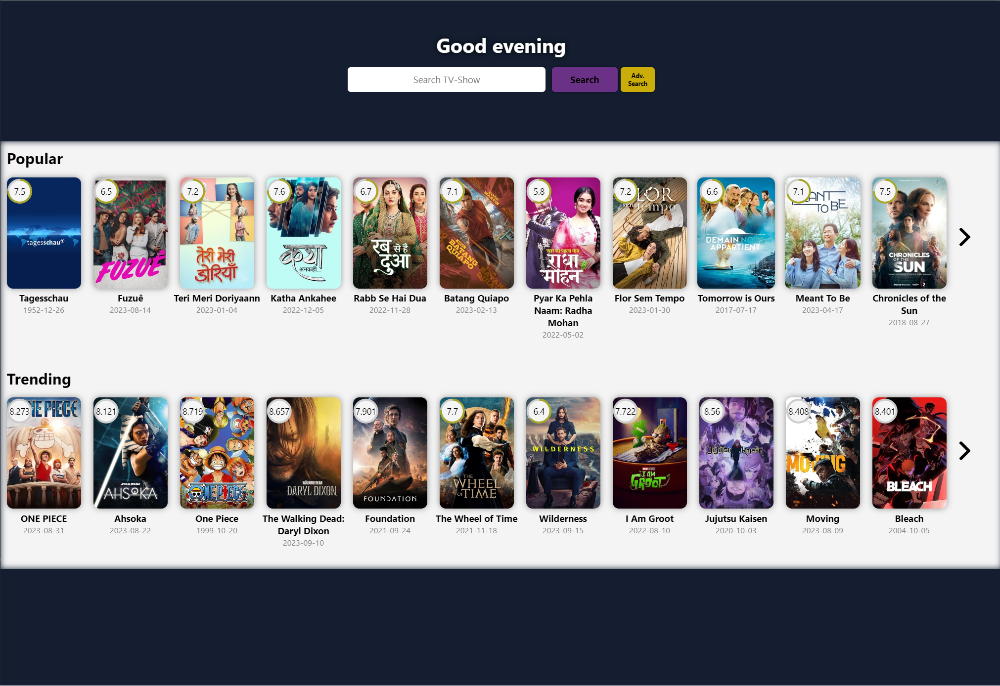
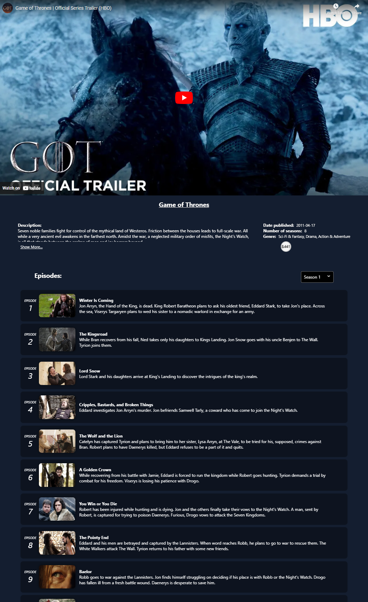

# Movies Project
MoviesProject is a web application that helps users to keep track of their favorite movies and TV shows, connect and chat with other users for each TV show and episode, and discover new content that they might enjoy. It also learns the user's likes and suggests new movies and TV shows based on those likes.

# MoviesProject features:
🖥️ A list of the most popular, current, and on-demand movies and TV shows
🖥️ The ability to save movies and TV shows as favorites
🖥️ Extra data about each movie or TV show, including actors, directors, and reviews
🖥️ The ability to give instant reviews of movies and TV shows
🖥️ A recommendation system that suggests new movies and TV shows based on the user's likes
🖥️ The ability to connect and chat with other users for each TV show and episode
🖥️ An admin panel that shows graphs and important data for the admin to control the app

MoviesProject is a great way for users to stay up-to-date on the latest movies and TV shows, discover new content, and connect with other fans. It is also a valuable tool for admins to track user engagement and manage their app.
To use MoviesProject, simply create an account and start browsing the list of movies and TV shows. You can save your favorites, read extra data about each movie or TV show, give instant reviews, and connect and chat with other users. MoviesProject will also start to learn your likes and suggest new movies and TV shows that you might enjoy.

